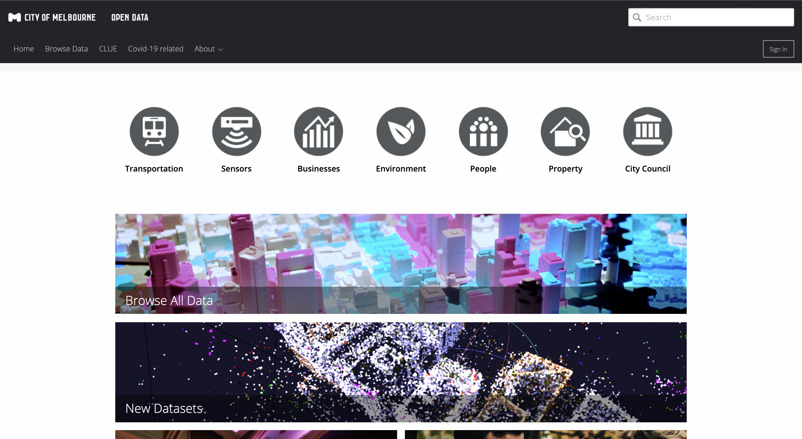
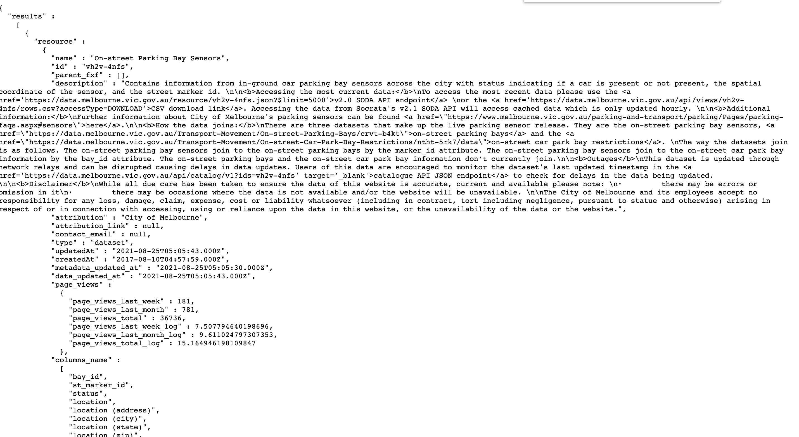
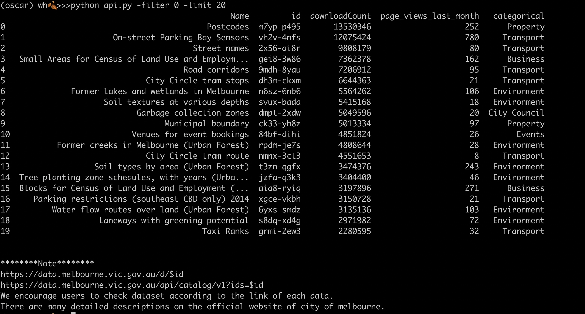
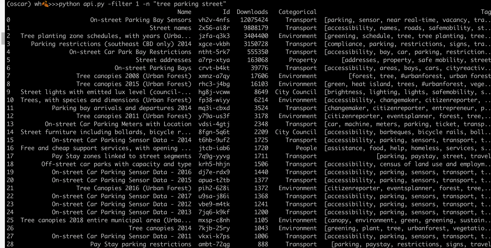

- [Open Data API](#open-data-api)
  - [Function](#function)
  - [Output](#output)
  - [Environment and Package Dependency](#environment-and-package-dependency)
  - [Tutorial](#tutorial)
    - [Download Repository](#download-repository)
    - [Parameters Describe](#parameters-describe)
  - [How to obtain APP Token](#how-to-obtain-app-token)

# Open Data API



**Author**: 𐐎 <br>
**Deakin University** <br>
**Client**: [**City of Melbourne**](https://data.melbourne.vic.gov.au/) <br>

There are lost of datasets in open data platform in 
[**City of Melbourne**](https://data.melbourne.vic.gov.au/), which can play with.

This program help my team member to inspect datasets and download dataset easily. 

For example, my team member "Mirriam". Even she has advance IT skills and she also feel confusion by inspecting dataset. Lots of information of each dataset storing in **Metadata** format, see example of "Pay Stay zones linked to street segments" as below:

**Metadata**
- name : Pay Stay zones linked to street segments
- attribution : City of Melbourne,
- attribution_link : null,
- contact_email : null,
- type : dataset,
- updatedAt : 2020-02-24T02:10:34.000Z,
- createdAt : 2017-11-01T03:43:04.000Z,
- metadata_updated_at : 2020-02-24T02:- 000Z,
- data_updated_at : 2018-03-02T01:- 000Z,
- categories : [ transportation ],
- domain_category : Transport,
- domain_tags : parking, paystay street, travel 
- **etc**





## Function
- Function 1: Return DataFrame of popular dataset, sorted by downloads
- Function 2: Given keywords, return DataFrame of related datasets
- Function 3: Download Dataset
- Function 4: Download all datasets which can be joined (not finish)


***
## Output
- filter 0: inspect popular datasets 
```
$python api.py -filter 0 -limit 20
```



- filter 1: search dataset

```
$python api.py -filter 1 -n "tree parking street"
```



- filter 2: download dataset

```
$python api.py -filter 2 -n vh2v-4nfs -limit 20
```


***
## Environment and Package Dependency 
- python3.8
- bs4
- requests
- sodapy
- AppToken
- pandas
- argparse
***
## Tutorial

***
### Download Repository


***
### Parameters Describe


## How to obtain APP Token


