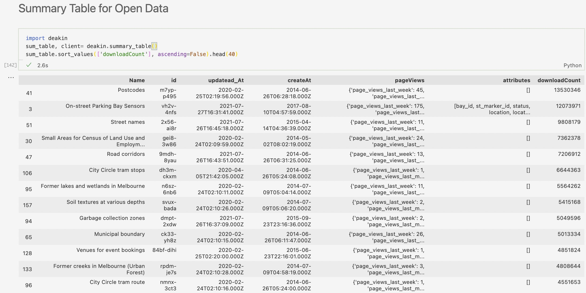
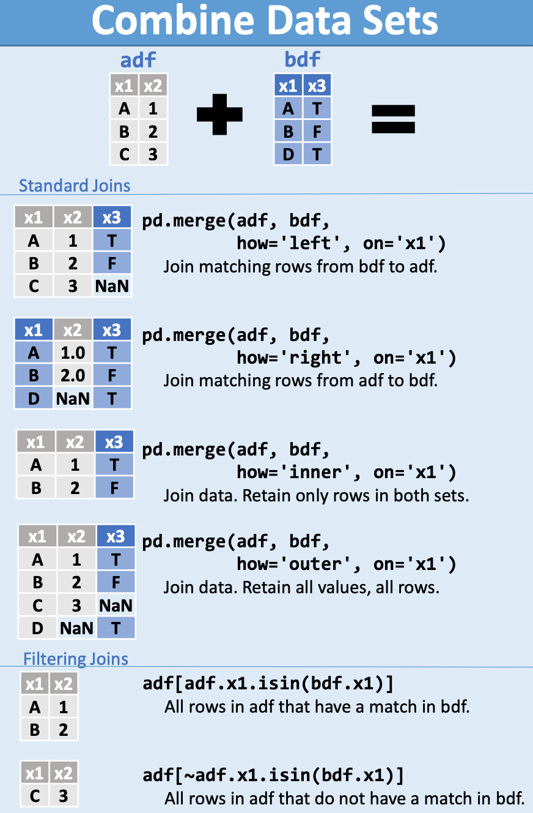
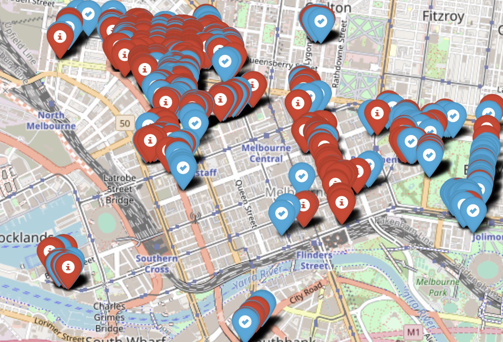

**Melbourne Open Data**
=========================

__Author__: Squad of City of Melbourne

__Deakin University__ 

__T2/2021__

.


----
# About Melbourne Data

Welcome to Melbourne Data - the City of Melbourne’s open data platform, where you can access and use a wide variety of publicly accessible council data. By publishing this data, we aim to increase transparency, improve public services and support new economic and social initiatives.
We would love to see how you’re using our data.

* Example Dataset: [On-street Parking Bay Sensors](https://data.melbourne.vic.gov.au/Transport/On-street-Parking-Bay-Sensors/vh2v-4nfs) 

* Machine Language: Python

* [App Token](https://dev.socrata.com/docs/app-tokens.html) (Optional)

* Package Need: `$1, $2, $3`

* Perquisite knowledge: `add something...`
* `Add more desciption (oscar)`  
  


---


Summary Table for Open Data
=====



---

Knowledge Refreshing: 
=======================

According to __Codecademy__, we give some description:

During your brainstorming phase, you should consider two things:

1. The focusing question you want to answer with your chart.
2. The type of data that you want to visualize
   
Depending on the focusing questions you’re trying to answer, the type of chart you select should be different and intentional in its difference. 

In the diagram below, we have assigned Matplotlib visualizations to different categories. These categories explore common focusing questions and types of data you may want to display in a visualization:


---


## 1. Reading dataset

`Oscar has worked up here:`

>replace this section with new function. 
Showing summary table of 222 datasets


```python
>>> from sodapy import Socrata
>>> client = Socrata(
        "sandbox.demo.socrata.com",
        "FakeAppToken",
        username="fakeuser@somedomain.com",
        password="mypassword",
        timeout=10
    )
```

* [Click here]() to see how to apply **App Token**
* [Click here]() to see how to use our function to get summaized overview dataset
* [Clcik here]() ....
* ....
* ....


---
## 2. Manipulation

* [Click here] to see [example code](example.ipynb) for **Data Description**.


---



`Mirriam is working here`

>Create EDA Code:
Plz create file with your EDA code.
Do not merge your code into **example.ipynb** file)


## 3. Analysis  

* [Click here](EDA.ipynb) to see example code for **EDA**

`Mirriam is working here`

Open the link ["Geo_Map.html"](Geo_Map.html) with your browser to check the parking status. Red means the parking space is occupied, and blue means the parking space is available. The screenshot below:




