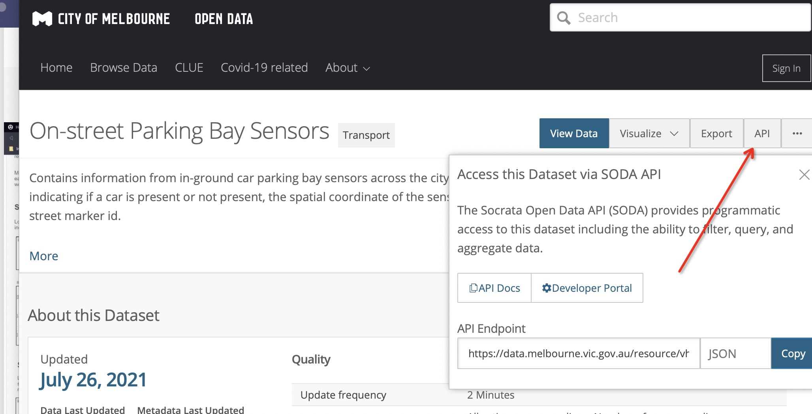

# Demo Code

__Author__: Squad of City of Melbourne

__Deakin University__ 

__T2/2021__

---
## Demonstrating how to use **Melbourne Open Data**

* Example Dataset: [On-street Parking Bay Sensors](https://data.melbourne.vic.gov.au/Transport/On-street-Parking-Bay-Sensors/vh2v-4nfs)

* Machine Language: Python

**Note** You can choose other dataset based on your need

---

## Knowledge Refresh: 
According to __Codecademy__, we give some description:

During your brainstorming phase, you should consider two things:

1. The focusing question you want to answer with your chart.
2. The type of data that you want to visualize
   
Depending on the focusing questions you’re trying to answer, the type of chart you select should be different and intentional in its difference. 

In the diagram below, we have assigned Matplotlib visualizations to different categories. These categories explore common focusing questions and types of data you may want to display in a visualization:


---


## 1. Reading dataset

* Find API show as below:
* Install necessary packages: __uncomment__ code of __line 2,3__ if you do not have install.



```python
# make sure to install these packages before running:
# pip install pandas
# pip install sodapy

import pandas as pd
from sodapy import Socrata

# Unauthenticated client only works with public data sets. Note 'None'
# in place of application token, and no username or password:
client = Socrata("data.melbourne.vic.gov.au", None)

# Example authenticated client (needed for non-public datasets):
# client = Socrata(data.melbourne.vic.gov.au,
#                  MyAppToken,
#                  userame="user@example.com",
#                  password="AFakePassword")

# First 2000 results, returned as JSON from API / converted to Python list of
# dictionaries by sodapy.
results = client.get("vh2v-4nfs", limit=2000)

# Convert to pandas DataFrame
results_df = pd.DataFrame.from_records(results)

```
---
## 2. Exploiting information from dataset

### See as [example code](example.ipynb)


---
## 3. Analysis of result  