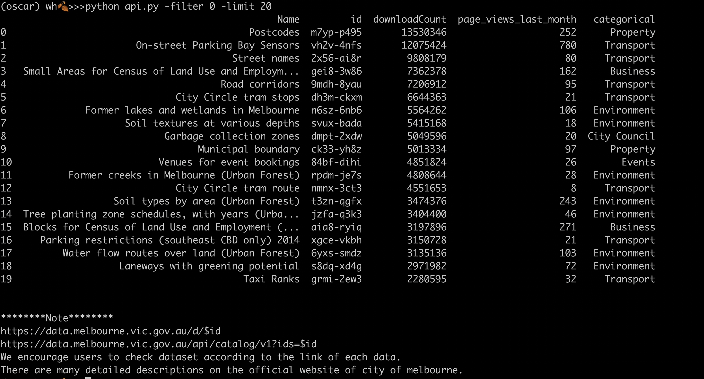
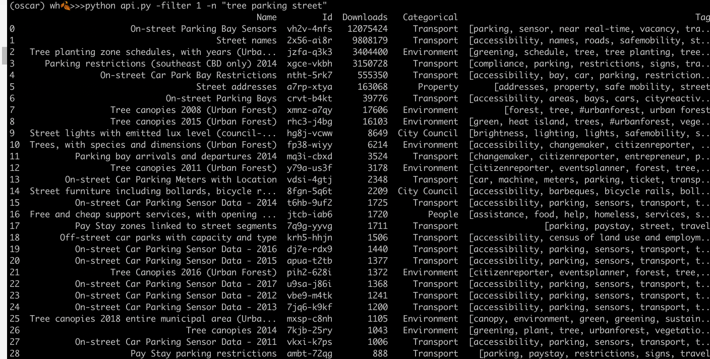
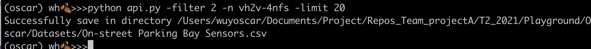

# Melbourne Open Data Playground
## OPEN DATA API

Last Updated: 9-Dec-2021


- [Open Data API](#open-data-api)
  - [Function](#function)
  - [Output](#output)
  - [Environment and Package Dependency](#environment-and-package-dependency)

# API Description

**Author**: Oscar Wu<br>
**Deakin University T2 2021 Cohort** <br>
**Client**: [**City of Melbourne**](https://data.melbourne.vic.gov.au/) <br>

There are a multitude of datasets in the open data platform for the [**City of Melbourne**](https://data.melbourne.vic.gov.au/), which are available for the community.

This program assists the with inspection and downloading of datasets. 

For example, some developers have advance IT skills and also feel confusion by inspecting dataset. Lots of information of each dataset storing in **Metadata** format, see example of "Pay Stay zones linked to street segments" as below:

**Metadata**
- name : Pay Stay zones linked to street segments
- attribution : City of Melbourne,
- attribution_link : null,
- contact_email : null,
- type : dataset,
- updatedAt : 2020-02-24T02:10:34.000Z,
- createdAt : 2017-11-01T03:43:04.000Z,
- metadata_updated_at : 2020-02-24T02:- 000Z,
- data_updated_at : 2018-03-02T01:- 000Z,
- categories : [ transportation ],
- domain_category : Transport,
- domain_tags : parking, paystay street, travel 
- **etc**


## Function
- Function 1: Return DataFrame of popular dataset, sorted by downloads
- Function 2: Given keywords, return DataFrame of related datasets
- Function 3: Download Dataset
- Function 4: Download all datasets which can be joined (not finish)


***
## Output
- filter 0: inspect popular datasets 
```
$python api.py -filter 0 -limit 20
```



- filter 1: serch dtset

```
$python api.py -filter 1 -n "tree parking street"
```



- filter 2: download dataset

```
$python api.py -filter 2 -n vh2v-4nfs -limit 20
```


***
## Environment and Package Dependency 
- python3.8
- bs4
- requests
- sodapy
- AppToken
- pandas
- argparse
***


